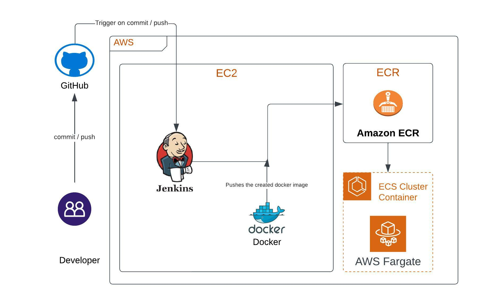

# webapp-orderbird

### project:

Displays the web application (index.html) running through the python flask. Jenkins takes the latest code commits and builds the docker image and saved into a ECR (Amazon Elastic Container Registry). And we are deploying a docker container with ECS and Fargate.



### Documentation
All the code and configure documents located under ```Docs``` dir

## Prerequisites
install all dependencies from the terminal, run the commands below

``` pip install -r all_requirements.txt ```

install sceptre library in virtual environment by running the commands below in a GitBash terminal

```
pip install virtualenv
virtualenv venv
source venv/Scripts/activate
pip install sceptre
```
### Additional tools
* Install [Git Bash](https://gitforwindows.org/)
* Install [Python](https://www.python.org/downloads/)  
  Note: Check the box "Add to Path" during installation.
* Install [SAM CLI](https://docs.aws.amazon.com/serverless-application-model/latest/developerguide/serverless-sam-cli-install.html)
* Install any code editor
* Install the [Docker](https://www.docker.com/products/docker-desktop/)

## Task before running any builds/tests locally

* Once the code changes has been done. Open the git bash terminal and run the ```./run-docker.sh```
* It will generate all the layers in the ```Dockerfile```

### Creating EC2 instance for jenkins and docker

* Create a EC2 instance from the [AWS EC2](https://us-east-1.console.aws.amazon.com/ec2/v2/home?region=us-east-1#Home) console.
* Enable the ```Auto-assign Public IP``` to ```Enable``` (where we need to connect jenkines with this IP address)
* Create an IAM role "ECRfullaccessEC2" (storing the docker images in the ECR)for EC2 service and assign to it.
* Add custom TCP Rule with port 8080 (jenkines runs on this port).
* create a new key pair and lanunch the instance.

#### Jenkins on AWS

Note: After connecting to the EC2 instance. Please follow the below steps to install the jenkins and docker

* To ensure that your software packages are up to date on your instance, use the following command to perform a quick software update:
  ```
  sudo yum update –y
  ```
* Add the Jenkins repo using the following command:
  ```
  sudo wget -O /etc/yum.repos.d/jenkins.repo \
    https://pkg.jenkins.io/redhat-stable/jenkins.repo
  ```
* Import a key file from Jenkins-CI to enable installation from the package:
  ```
  sudo rpm --import https://pkg.jenkins.io/redhat-stable/jenkins.io.key
  sudo yum upgrade
  ```
* Install Java:
  ```
  sudo amazon-linux-extras install java-openjdk11 -y
  ```
* Install Jenkins:
  ```
  sudo yum install jenkins -y
  ```
* Enable the Jenkins service to start at boot:
  ```
  sudo systemctl enable jenkins
  ```
* Start Jenkins as a service:
  ```
  sudo systemctl start jenkins
  ```
* You can check the status of the Jenkins service using the command:
  ```
  sudo systemctl status jenkins
  ```
## Configure Jenkins
Jenkins is now installed and running on your EC2 instance. To configure Jenkins:
* Connect to http://<your_server_public_DNS>:8080 from your favorite browser. You will be able to access Jenkins through its management interface:
* As prompted, enter the password found in /var/lib/jenkins/secrets/initialAdminPassword.
  ```
  sudo cat /var/lib/jenkins/secrets/initialAdminPassword
  ```
#### Docker on AWS
* Update the installed packages and package cache on your instance.
  ```
  sudo yum update -y
  ```
* Install the most recent Docker Engine package.
  ```
  sudo amazon-linux-extras install docker
  ```
* Start the Docker service.
  ```
  sudo service docker start
  ```
* (Optional) To ensure that the Docker daemon starts after each system reboot, run the following command:
  ```
  sudo systemctl enable docker
  ```
* Add the ec2-user to the docker group so you can execute Docker commands without using sudo.
  ```
  sudo usermod -a -G docker ec2-user
  ```
* To know the docker status.
  ```
  sudo service docker status
  ```
### Add Jenkins user to Docker group
  ```
  sudo usermod -a -G docker jenkins
  ```
  Restart Jenkins service
  ```
  sudo service jenkins restart
  ```
  Restart Docker service
  ```
  sudo service docker restart
  ```
  
# To configure jenkins pipeline 

Please download the jenkins.docx file from ```docs``` dir


